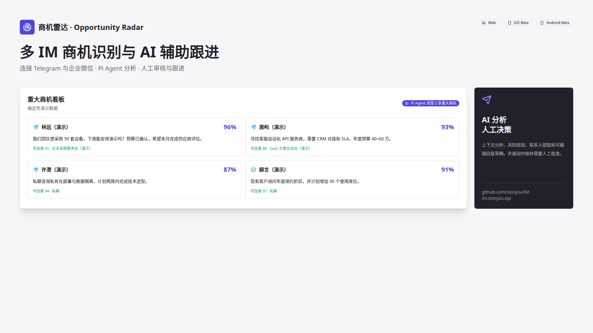
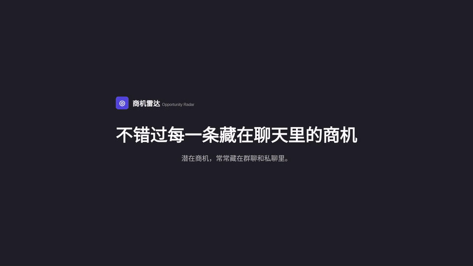
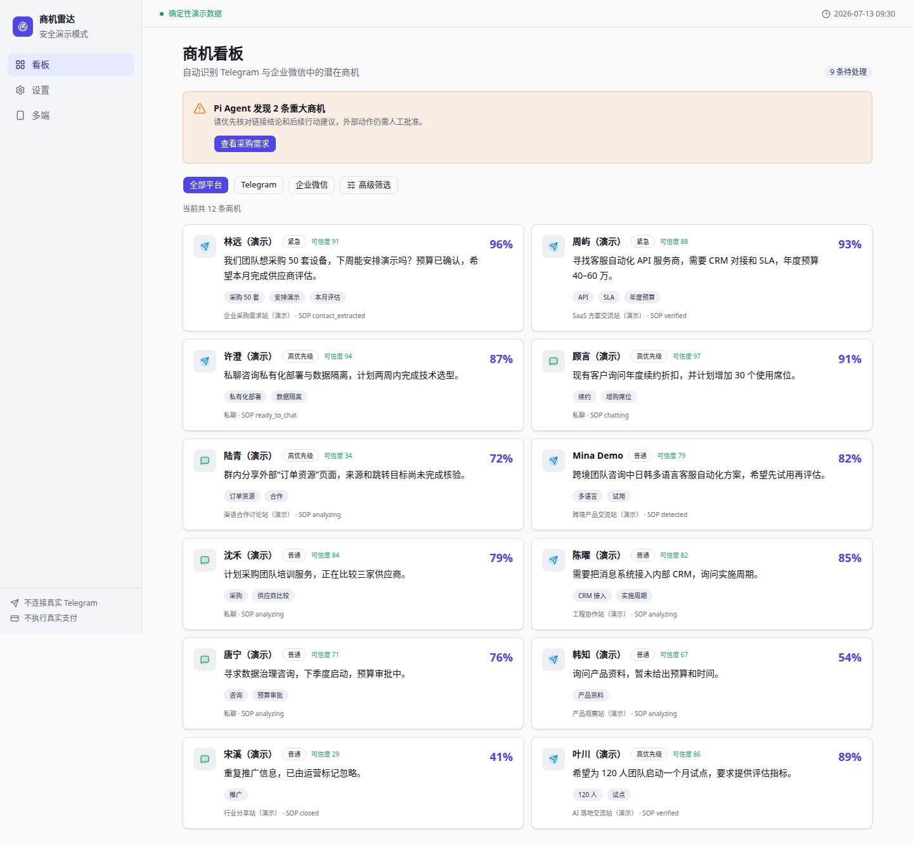
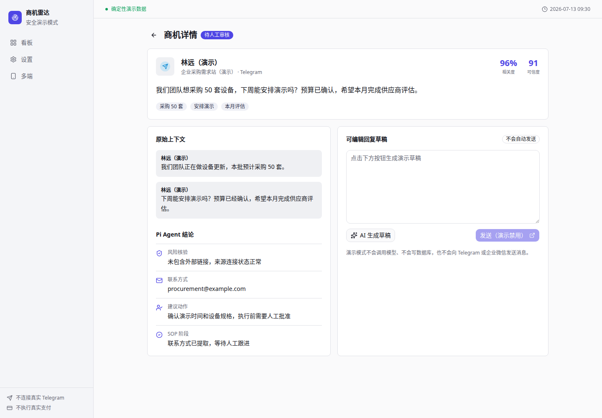
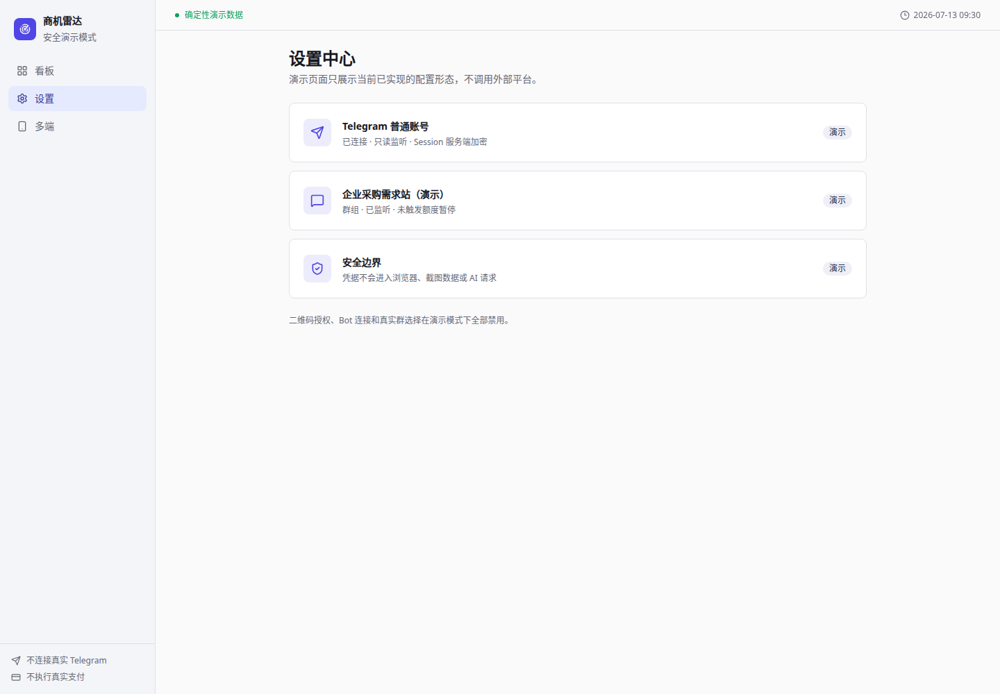
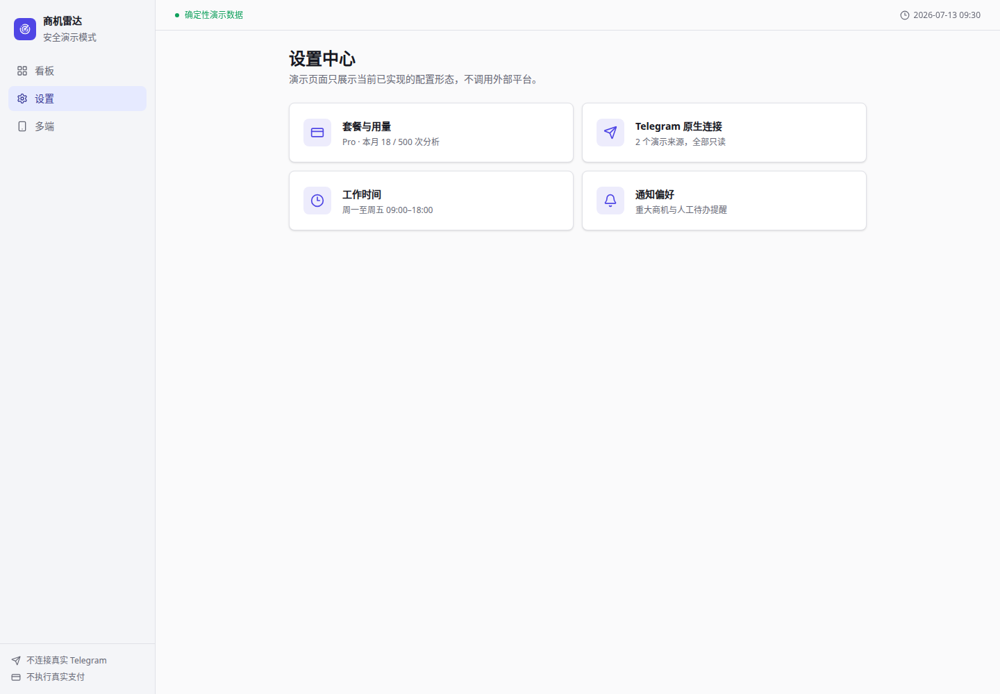

<div align="center">
  
  <h1>商机雷达 · Opportunity Radar</h1>
  <p>多 IM 渠道商机识别与 AI 辅助跟进工具</p>
  <p><a href="https://im.story2u.xyz">在线产品</a> · <a href="docs/demo/recording-runbook.md">生成演示资产</a> · <a href="docs/product/feature-map.md">功能成熟度</a></p>
</div>

[](https://github.com/story2u/IM/releases/latest)

> 在线首页无需账号；进入真实商机看板需要 Google 或 Apple 登录。完整 MP4/WebM 作为 GitHub
> Release 资产发布，仓库中的短 GIF 仅用于快速预览。



## 产品截图

| 商机看板 | 商机详情 |
| --- | --- |
|  |  |

| Telegram 连接 | 设置中心 |
| --- | --- |
|  |  |

| iOS | Android |
| --- | --- |
| Beta；自动截图需 macOS/Xcode，当前未发布 TestFlight | Beta；自动截图需 Android Emulator，APK 尚未作为 Release 发布 |

## 核心能力

- 连接 Telegram Bot、普通账号只读来源与企业微信 Webhook。
- 使用确定性规则与 LiteLLM 语义复核识别群聊和私聊商机。
- Pi Agent 整理上下文、核验公开链接、提取联系人和建议下一步动作。
- 白天人工审核；非工作时间按安全策略处理，AI 新发现的商机仍强制人工审核。
- Web、iOS、Android 共享后端用户和订阅权益。
- RevenueCat 聚合 Paddle、App Store 和 Google Play；外部 Sandbox 仍需人工配置验证。

## 工作流程

```text
消息渠道 → 幂等摄取 → 规则/语义识别 → Pi Agent 结构化分析 → 人工审核与跟进
```

后端是受限业务 API 的最终权限来源。客户端 CustomerInfo、演示数据和模型输出都不能直接提升权益
或执行外部动作。

## 系统架构

- Web：Next.js 16、React 19、Tailwind、shadcn/ui
- API：FastAPI、SQLModel、PostgreSQL、Redis
- Worker：Celery、LiteLLM、LangChain、受限 pi Agent runner
- Mobile：SwiftUI / Swift Concurrency、Kotlin / Jetpack Compose
- Billing：RevenueCat + Paddle/App Store/Google Play，本地权益投影最终裁决

详见 [架构总览](docs/architecture/overview.md)。

## 本地启动

```bash
cd backend
cp .env.example .env
docker compose up -d postgres redis migrate api celery_worker celery_beat

cd ../frontend
corepack pnpm@10.25.0 install --frozen-lockfile
corepack pnpm@10.25.0 dev
```

## Demo Mode

```bash
make demo-web
make demo-screenshots
make demo-record
make demo-video
make demo-assets
```

`DEMO_MODE=true` 与 `NEXT_PUBLIC_DEMO_MODE=true` 仅由本地/资产工作流设置。`/demo/*` 使用固定虚构
数据，不请求生产用户 API、不初始化支付、不连接 Telegram，也不执行发送。生产默认关闭并返回 404。

## 安全边界

- 用户资源按后端 `users.id` 隔离；Telegram Session 仅以服务端密文持久化。
- Webhook 执行验签与幂等；模型输入不包含 Telegram Token、API Hash 或 Session。
- AI 草稿与 Agent 外部动作建议必须经人工确认。
- Demo Dataset 只使用 `example.com`、虚构群名、固定时间和演示身份。

## 当前成熟度

Telegram Bot 摄取、商机识别、基础看板和后端回复链路已实现；部分 Web 编辑操作、通知偏好、移动端
分发与真实支付 Sandbox E2E 仍为 Beta 或待外部验证。权威状态见[功能地图](docs/product/feature-map.md)。

## Release 下载

- Android Demo APK：尚未发布；Release 工作流模板已准备，产物仅用于测试。
- iOS：尚未开放 TestFlight，不自动上传 IPA。
- Demo 视频：运行 `Demo Assets` workflow 后作为 Release Asset 上传。

## Roadmap

- 完成 RevenueCat/Paddle/App Store/Play Sandbox E2E。
- 将前端仍为本地状态的设置与回复动作迁移到真实 API。
- 完成 iOS TestFlight 与 Android 测试渠道分发。
- 在真实但脱敏的金标数据上校准商机识别阈值。

## License

仓库当前未提交开源许可证。在添加明确许可证前，不应假定代码或资产可被自由再分发。
